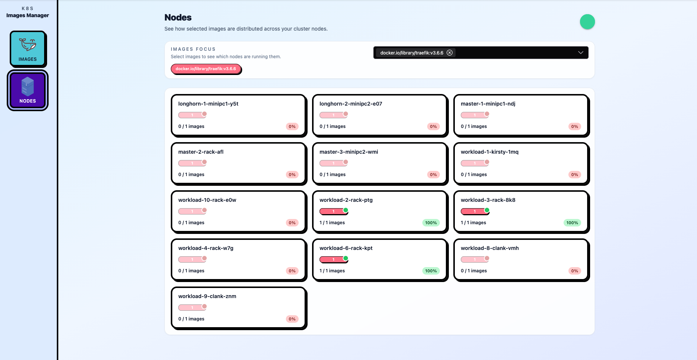

# k8s-images-manager


[](#)
[](#)
[](#)

## Getting start

> [!WARNING]
> Rust agent runs as daemonset inside your cluster and requires privileges to be able to list downloaded images
> 
> It requires:
> - [HostNetwork: true](https://github.com/Tchoupinax/k8s-images-manager/blob/master/chart/templates/agents.yaml#L26)
> 
> - [Binding containerd socket (k3s only for now!)](https://github.com/Tchoupinax/k8s-images-manager/blob/21bf40b02947c9b23686ebec0cab99133e35908f/chart/templates/agents.yaml#L66)
> - [Being privileged](https://github.com/Tchoupinax/k8s-images-manager/blob/21bf40b02947c9b23686ebec0cab99133e35908f/chart/values.yaml#L95)
>
> Improvements will be done to limit these requirement in the future.

### With `Helm`

```
helm install k8s-images-manager oci://ghcr.io/tchoupinax --create-namespace -n k8s-images-manager
```

### With `Chart.yaml` and `Helm`

```
apiVersion: v2
name: k8s-images-manager
type: application
version: 1.0.0

dependencies:
- name: k8s-images-manager
  version: 0.1.0
  repository: oci://ghcr.io/tchoupinax
```
## Motivation

If you manager a cluster, you know that Dockerhub's rate limit can be hard if you did not anticipate it. There are many tips to handle it, one is to have an [embedded registry mirror](https://docs.k3s.io/installation/registry-mirror) that I wanted to setup with k3s.

But to check that this registry is working, I need to monitor how images are managed accros the nodes.

That's the reason of this project, and that's all. Sometimes, it's really simple.

## Features

### List images from the cluster

To be done

### Show which nodes have specific images


## Roadmap

- [ ] Make agent compatible with Kubernetes distribution
    - [x] k3s
    - [ ] Minikube
    - [ ] EKS
    - [ ] GKE
    - [ ] Talos
- [ ] Make agent compatible with Docker engine
- [ ] Make agent binary the most light possible (using scratch)
- [ ] Improve UI
  - [ ] Nodes dashboard
